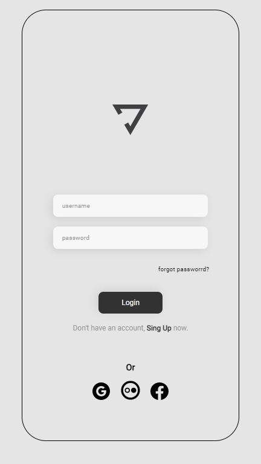

# Projeto Cadastro de Usuários 

> Projeto pessoal desenvolvido com o objetivo de aprimorar habilidades com HTML, CSS, JS e ReactJS.

### Criação do Projeto

O Projeto é voltado para mobile e visa reproduzir a primeira pagina onde o usuário realizaria login em um determinado aplicativo.

Durante desenvolvimento do projeto foram utilizados diversos conceitos de JavaScript

